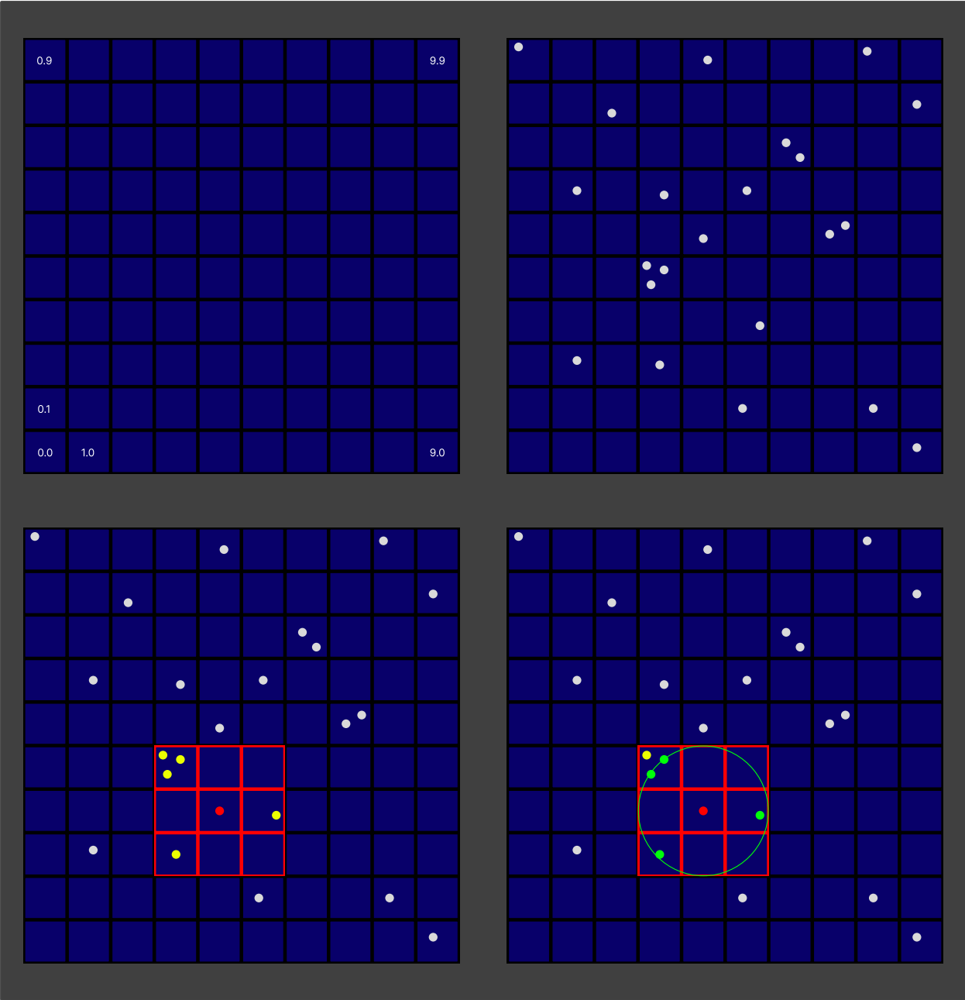
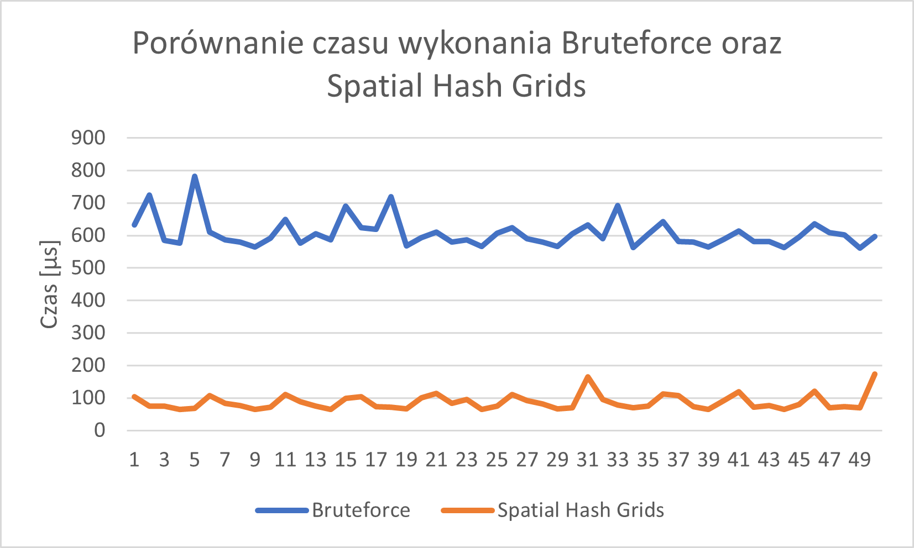

# Spatial hash grids
## Problem
Artifacts move around the map based on vectors contained in `.txt` files. At certain times, Jedi appear on the map and want to collect artifacts. Their positions are also in `.txt` files. When they appear, we want to check which artifacts are at such a distance from the Jedi that he can obtain them.

This problem is very similar to collision detection in games.

### Simple solution
The simplest option is brute force, which involves checking the distance of each jedi from each artifact.

### Better solution
A better option is to use a method such as Spatial hash grid. Its operation is shown in the image below.

1. We divide the area into smaller cells,
1. When we add artifacts, we assign them to individual cells,
1. When a Jedi appears, we choose cells near Jedi,
1. We calculate the distances of artifacts from jedi in previously selected cells.

## Config file
In the configuration file, we can set things such as map dimensions, search radius, file names in which the data will be stored, etc.
Sample file: [config/config.json](config/config.json)

## Duration
The measured search duration will be saved in `logs/` folder.

Sample measured time differences based on 50 trials.

## Running program
In the main function we provide the file location of the configuration file and choose optimization type. Then we create `Map` object, initialize artifacts and Jedis and then run the `play()` function. 

### Optimization types:
0 - bruteforce,
1 - spatial hash grid

## Used libraries
1. [jsoncpp](https://github.com/open-source-parsers/jsoncpp)